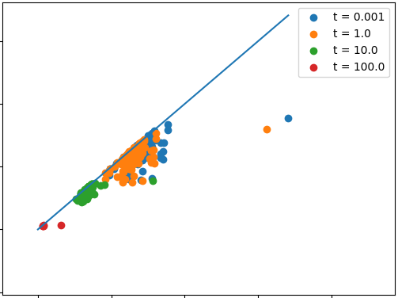

# Reproduction of "Persistence-based Structural Recognition" experiments

Here are some implementations of the expirements done in the paper "Persistence-based Structural Recognition" by Chunyuan Li, Maks Ovsjanikov and Frederic Chazal.

## How to use?

Execute `pip install -r requirements.txt` to install dependencies. Then unzip `Data_Hand.zip` in a `Data_Hand` folder and `Data_Perso.zip` in a `Data_Perso` folder.

### Experiment 1: Hand Gesture Recognition

The command to execute: `python3 exp1.py`

This computes the 0-persistence diagrams of the HKS function at different times and plots them :

### Experiment 2: Hand Gesture Recognition

The command to execute: `python3 exp2.py`

This computes the confusion matrix:

